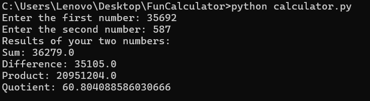

# 🎉 Fun Calculator 🎉

Welcome to the **Fun Calculator**—a playful Python mini-app that performs basic arithmetic operations like a boss! 😎  
Whether you're adding, subtracting, multiplying, or dividing, this calculator makes math feel magical. ✨

## 🚀 Features

- ➕ Addition
- ➖ Subtraction
- ✖️ Multiplication
- ➗ Division (with decimal support!)

## 🛠️ Technologies Used

- Python 3
- Command Line (Terminal)
- Git & GitHub

## 📦 How to Run It

1. Open Command Prompt
2. Go to your folder:
   ```bash
   cd Desktop\FunCalculator
3. Run the calculator:
python calculator.py

## 📸 Screenshot

Here’s what the Fun Calculator looks like when it runs:



🙌 Author
Victor Owinyo


